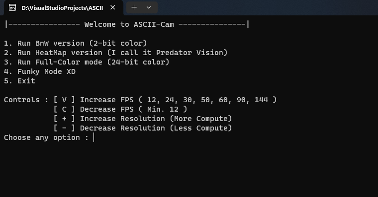
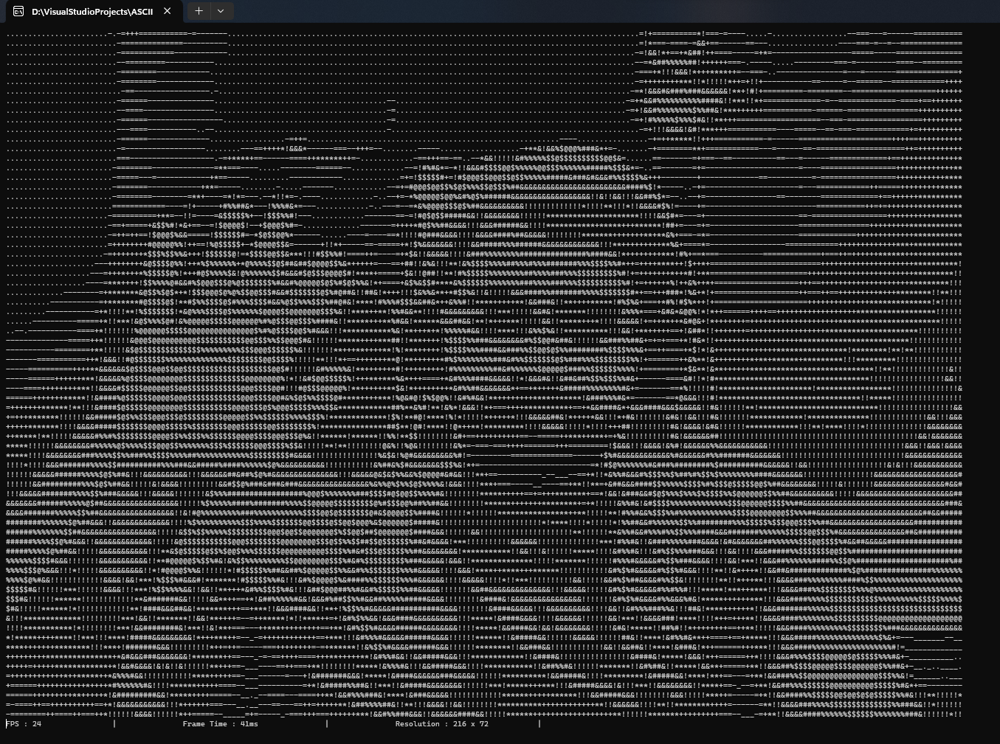
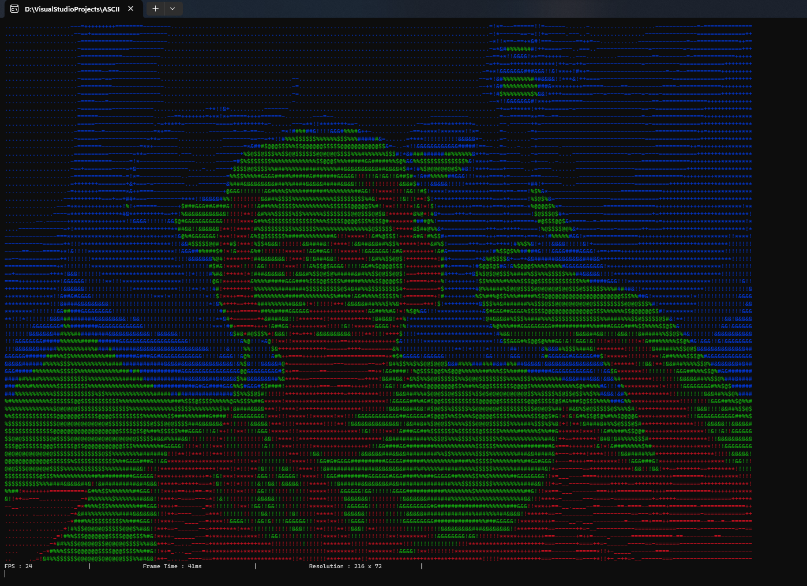
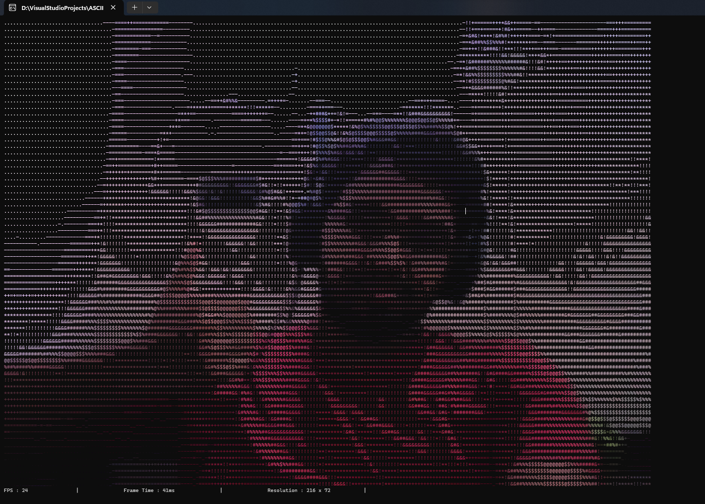
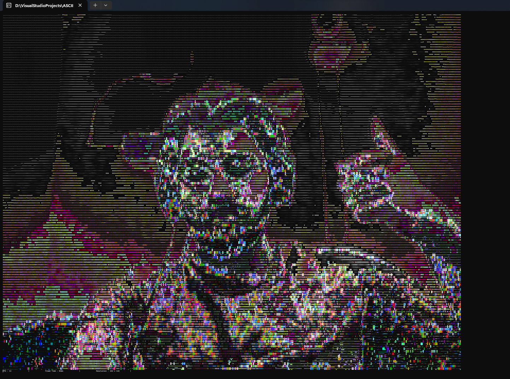

<h1 align="center">ASCII Art</h1>

## Webcam to ASCII
>
> 
<h5 align="center">First Iteration of this Project</h5>

## So what's all the fuss about?
>
> The idea is to take a video input stream from the default webcam, and then translate each pixel into an ASCII character depending on it's `brightness` value and then print it into the terminal.
>
> The `brightness` or `intensity` is calculated as a `mean` of the R, G and B values of each pixel.
>
> Each frame is thus encoded into a string of these characters and then printed into the terminal.
>
> I played around with the string of characters that the brightness depends on, and figured it looks best when the shadows and highlights are "muted", i.e, having light characters.

## What are the Use Cases for this?
>
> I don't know, I just wanted to do it.
> 
> It seemed like fun and I haven't seen > anyone play with OpenCV in C++ before. 
> It was a good learning experience, and I also got to put my C++ knowledge to the test.

## How to run this?
>
> - Just clone the repo
> - Run the `Video_to_ASCII.sln` file in Visual Studio
> - As a pre-requisite, you need to have OpenCV installed on your system and linked to the project.
> - Once that's done, simply hit `Build` and there you go!

## About the Project (Features):

> There are 4 different "*styles*" of ASCII that have been implemented.
>
> 
>
> - #### The first one is the most basic one, where the characters are simply printed into the terminal. It's only **Black and White** (white characters against a black terminal background.)
>
> 
>
> - #### The second one is like a **"Heat-Map"**, (looks so similar to Predator Vision to me, except it's ASCII). This one has only 3 colors, Red, Green and Blue. Red for the Shadows, Green for the Midtones and Blue for the Highlights.
>
> 
>
> - #### The third one is **full color**, apparently Terminal supports upto 24-bit color through ANSI escape codes. This one looks amazing.
>
> 
>
> - #### The fourth one is where things got wild. It looks like a *psychedelic* trip, but it's fun to look at. Also it was pure accident that I stumbled upon this one.
>
> 
> 
> ### Features implemented:
> - Go from the camera screen to the Menu when user hits [Esc]
> - You can increase/decrease the refresh rate of the output stream on the fly,
>   however, this is limited by the speed of the webcam as well as the
>   speed of printing characters in the terminal.
> - You can also increase/decrease the resolution of the output stream on the fly, in the terminal window. However, this feature is buggy and increased resolution will put a harder hit on the CPU. As such it is not recommended, but it's there.
>

## Few Notes:
>
> - I thought about adding GPU acceleration to this, however, it doesn't make
sense to run such a sequential program on a GPU. The overhead of copying
data to and from the GPU would be too much and may even slow down the
speed of the program significantly as compared to running it raw on the CPU.
>
> - Even in the case of parallelizing the program, I wasn't sure how to pull
that off given the sequential nature of the program.
>
> - One feature that **DEFINITELY** can be implemented is a frame buffer, so that
the program can run at a much smoother frame rate. Currently, the frames are all
processed in real-time and directly pushed to terminal. Far from ideal, this is the main reason why the program is so slow when more colors are used.